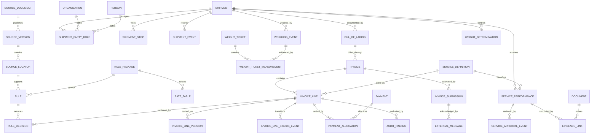

# Provisional Conceptual Schema

> Status: provisional. Derived from the first reviewed 400NG, Tender of Service,
> and TPPS pages. Rate-workbook and EDI element inspection are still pending.

## Model shape

## Key modeling conclusions

### Facts are observations, not mutable shipment columns

Weights, approvals, statuses, submissions, and payments can occur repeatedly and
can contradict earlier observations. Store each event and derive the current or
controlling value through an explicit decision.

### Performance, authorization, and billing are distinct

A service can be requested, preapproved, performed, documented, billed, disputed,
and paid. Those are different events. A single `services` row with boolean flags
would erase order, actors, reasons, and evidence.

### External vocabularies remain versioned boundaries

400NG item numbers, DPS/TPPS billing item codes, EDI identifiers, SCACs, and
government office codes should be versioned reference records. Internal entities
may reference them but should not use the external code as the database primary
key.

### Financial records are append-only

An invoice may have multiple submissions and a BL may have multiple invoices.
Disputed quantities can be revised, while approved or denied lines have different
constraints. Preserve versions and adjustments instead of updating the original
line in place.

### Evidence proves a claim, not merely a shipment

Documents should link to the exact fact, service, invoice line, or approval they
support. This permits an audit finding to distinguish missing evidence from an
ineligible or incorrectly calculated charge.

## Physical types intentionally deferred

Identifiers will remain logical identifiers until DTEB/TPPS length and character
constraints are inspected. Money will use exact decimal semantics; weights and
other quantities will carry explicit units. Dates, local times, and instants will
not be collapsed into strings.
