# Provisional Conceptual Schema

> Status: provisional. Derived from reviewed 400NG, Tender of Service, TPPS,
> DTR Chapter A-413, DTR Chapter A-402 lifecycle/SIT pages, and 400NG SIT
> eligibility/rating sections, and the archived P0 rate, item-code, transit, and
> mileage/SIT workbook structures. EDI element inspection is still pending.

## Model shape

```mermaid
erDiagram
    SOURCE_DOCUMENT ||--o{ SOURCE_VERSION : publishes
    SOURCE_VERSION ||--o{ SOURCE_LOCATOR : contains
    SOURCE_LOCATOR ||--o{ SOURCE_CLAIM : supports
    CONFLICT_CASE ||--|{ CONFLICT_CLAIM : contains
    SOURCE_CLAIM ||--o{ CONFLICT_CLAIM : participates_in
    CONFLICT_CASE ||--o{ INTERPRETATION_DECISION : resolved_by
    INTERPRETATION_DECISION ||--o{ DECISION_IMPACT : affects
    SOURCE_LOCATOR ||--o{ RULE : supports
    RULE_PACKAGE ||--o{ RULE : groups
    RULE_PACKAGE ||--o{ RATE_TABLE : selects

    SHIPMENT ||--o{ SHIPMENT_PARTY_ROLE : assigns
    ORGANIZATION ||--o{ SHIPMENT_PARTY_ROLE : fulfills
    PERSON ||--o{ SHIPMENT_PARTY_ROLE : fulfills
    SHIPMENT ||--o{ SHIPMENT_STOP : visits
    SHIPMENT ||--o{ SHIPMENT_EVENT : records
    SHIPMENT ||--o{ SHIPMENT_PORTION : divides_into
    SHIPMENT ||--o{ BILL_OF_LADING : documented_by

    SHIPMENT ||--o{ WEIGHING_EVENT : weighed_by
    WEIGHT_TICKET ||--o{ WEIGHT_TICKET_MEASUREMENT : contains
    WEIGHING_EVENT ||--o{ WEIGHT_TICKET_MEASUREMENT : evidenced_by
    SHIPMENT ||--o{ WEIGHT_DETERMINATION : controls

    SHIPMENT ||--o{ SERVICE_PERFORMANCE : receives
    SERVICE_DEFINITION ||--o{ SERVICE_PERFORMANCE : classifies
    SERVICE_PERFORMANCE ||--o{ SERVICE_APPROVAL_EVENT : reviewed_by
    SERVICE_PERFORMANCE ||--o{ EVIDENCE_LINK : supported_by
    DOCUMENT ||--o{ EVIDENCE_LINK : proves

    SHIPMENT ||--o{ SIT_EPISODE : stored_as
    SHIPMENT_PORTION o|--o{ SIT_EPISODE : stored_as
    SIT_FACILITY ||--o{ SIT_EPISODE : holds
    SIT_EPISODE ||--o{ SIT_AUTHORIZATION_EVENT : authorized_by
    SIT_EPISODE ||--o{ SIT_EXTENSION : extended_by
    SIT_EPISODE ||--o{ SIT_RELEASE_EVENT : released_by
    SIT_EPISODE ||--o| SIT_CONVERSION_EVENT : converted_by

    BILL_OF_LADING ||--o{ INVOICE : billed_through
    INVOICE ||--|{ INVOICE_LINE : contains
    SERVICE_DEFINITION ||--o{ INVOICE_LINE : billed_as
    INVOICE_LINE ||--o{ INVOICE_LINE_VERSION : revised_as
    INVOICE_LINE ||--o{ INVOICE_LINE_STATUS_EVENT : transitions
    INVOICE ||--o{ INVOICE_SUBMISSION : submitted_by
    INVOICE_SUBMISSION ||--o{ EXTERNAL_MESSAGE : acknowledged_by

    INVOICE_LINE ||--o{ PAYMENT_ALLOCATION : settled_by
    PAYMENT ||--o{ PAYMENT_ALLOCATION : allocates
    INVOICE_LINE ||--o{ AUDIT_FINDING : evaluated_by
    RULE ||--o{ RULE_DECISION : executes
    INVOICE_LINE ||--o{ RULE_DECISION : explained_by
```

## Key modeling conclusions

### Facts are observations, not mutable shipment columns

Weights, approvals, statuses, submissions, and payments can occur repeatedly and
can contradict earlier observations. Store each event and derive the current or
controlling value through an explicit decision.

### Performance, authorization, and billing are distinct

A service can be requested, preapproved, performed, documented, billed, disputed,
and paid. Those are different events. A single `services` row with boolean flags
would erase order, actors, reasons, and evidence.

### External vocabularies remain versioned boundaries

400NG item numbers, DPS/TPPS billing item codes, EDI identifiers, SCACs, and
government office codes should be versioned reference records. Internal entities
may reference them but should not use the external code as the database primary
key.

### Financial records are append-only

An invoice may have multiple submissions and a BL may have multiple invoices.
Disputed quantities can be revised, while approved or denied lines have different
constraints. Preserve versions and adjustments instead of updating the original
line in place.

### Evidence proves a claim, not merely a shipment

Documents should link to the exact fact, service, invoice line, or approval they
support. This permits an audit finding to distinguish missing evidence from an
ineligible or incorrectly calculated charge.

### SIT is a lifecycle episode, not a shipment flag

A shipment or split portion may enter SIT at origin, destination, or an
intermediate point. Each episode has its own request and approval history,
facility, control identifier, effective dates, extensions, releases, and possible
conversion from Government to customer expense. Delivery out and conversion do
not erase the episode or its prior payer responsibility.

### SIT rating context is separate from physical storage

The accepted BL Block 19 or 18 address selects origin or destination SIT rate
geography even when the goods are held elsewhere. Preserve that rating anchor,
the actual facility, the applicable service area and mileage observation, and
the rule decision that chose each. Split storage and partial delivery also need
charge-specific weight-basis decisions rather than one shipment weight.

### SIT charge time is an explained interval

Storage normally counts both the placed-in and removed-from dates, but accrual
may stop earlier under the requested-delivery and Government-business-day rule.
Store the raw date events, calendar version, authorization period, and calculated
charge interval separately so the billed day count remains reproducible.

### Rate geography and bands are versioned data

ZIP3-to-BPC-to-service-area assignments, service schedules, SIT schedules,
distance bands, weight bands, and rate cells belong to immutable source versions.
Identifiers retain leading zeros, quantities carry units, and each selected cell
retains its workbook/sheet/cell provenance and effective-date decision.

### Billed codes are not service definitions

The item-code workbook adds date-basis, discount, fuel, unit, location, EDI, and
approval requirements to a billed code. Keep that code version separate from the
tariff service definition and performed service so one audit can explain why a
specific external code and evidence bundle were required.

### Spreadsheet logic is source input, not the execution engine

Formula-bearing tools may document lookup behavior, but deterministic code and
approved versioned tables must produce system results. Formula text, cached
values, selected branches, and source conflicts remain provenance; the system
must not delegate a financial or entitlement decision to an opaque workbook.

### Source claims and interpretations are first-class records

A source locator may support one or more normalized claims. Competing claims and
version gaps join a conflict case without overwriting one another. A scoped,
versioned interpretation decision records reviewer, rationale, effective scope,
and affected rules/tests; unresolved material cases stop only the dependent
decision and enter human review.

### Shipment dates are typed observations

Counseling dates, booking preferences, pre-move agreements, calculated RDDs,
delivery offers, schedules, and actual events can differ. Preserve their roles,
sources, actors, and recorded times; derive the controlling date through an
explicit rule decision rather than updating a generic pickup or delivery field.

## Physical types intentionally deferred

Identifiers will remain logical identifiers until DTEB/TPPS length and character
constraints are inspected. Money will use exact decimal semantics; weights and
other quantities will carry explicit units. Dates, local times, and instants will
not be collapsed into strings.
