# Domestic DP3 Post-Audit Logical Schema

Status: draft logical contract for version one  
Scope: domestic DP3, TSP-to-government post-audit  
Physical database types: intentionally deferred until the external EDI and deployment constraints are known

## 1. Purpose and governing conventions

This schema turns the accepted conceptual model and the 91 reviewed/provisional discoveries in
`schema-discovery.md` into an implementation-neutral data contract. It describes
business identity, fields, logical types, units, cardinality, validation,
sensitivity, provenance, and lifecycle. It does not approve disputed source
interpretations or make spreadsheet formulas executable rules.

Every source-derived record carries enough provenance to identify the archived
artifact and the passage or cell range supporting it. Production calculations may
use only published, immutable rule packages. Source claims marked `candidate`,
`reviewed`, or `disputed` may be displayed and reviewed but may not select a
production financial result; only a scoped `approved` interpretation may do so.

### 1.1 Logical types

| Logical type | Meaning and validation |
|---|---|
| `ID<T>` | Opaque internal identifier for entity `T`; stable and never reused. |
| `EXTERNAL_ID` | Identifier from an external namespace; stored with namespace, issuer, and normalized value. |
| `CODE` | Controlled value resolved through a versioned vocabulary or rule package. |
| `TEXT` | Unicode text; length limits are physical-design concerns unless a source specifies one. |
| `LOCAL_DATE` | Calendar date without an implied time zone. |
| `INSTANT` | UTC-normalized timestamp plus the captured source offset when supplied. |
| `DATE_INTERVAL` | Start and end local dates with explicit inclusive/exclusive semantics. |
| `DECIMAL` | Exact base-10 value; binary floating point is forbidden. |
| `MONEY` | Exact decimal amount plus ISO 4217 currency code. |
| `QUANTITY<U>` | Exact decimal value plus explicit unit `U`, such as `lb`, `mile`, or `day`. |
| `PERCENT` | Exact decimal percentage with an explicit scale convention. |
| `BOOLEAN` | True or false; unknown is represented by a nullable field or an explicit decision status. |
| `HASH` | Algorithm-tagged content digest. |
| `URI` | Validated resource locator used only for managed evidence retrieval. |
| `STRUCTURED_VALUE` | Schema-versioned object used for lossless boundary payloads, never as a substitute for modeled business fields. |

### 1.2 Cardinality notation

- `1` means required exactly once.
- `0..1` means optional and at most once.
- `0..*` means optional and repeatable.
- `1..*` means required and repeatable.
- A nullable value must have a reason code when the fact was expected but unavailable.
- Conditional requirements are enforced by a published rule or evidence requirement,
  not by silently treating a field as optional.

### 1.3 Common metadata

The following fields apply where indicated and are not repeated in every table.

| Field set | Fields | Cardinality | Validation | Sensitivity | Source basis |
|---|---|---:|---|---|---|
| Entity identity | `id` | 1 | Correct entity namespace; immutable | Internal | System design policy |
| Record audit | `recorded_at`, `recorded_by`, `record_source_kind` | 1 | Append-only timestamp and actor/service identity | Internal | Auditability requirements in `goal.md` |
| Source provenance | `source_version_id`, `source_locator_id`, `interpretation_status` | 1 for source-derived facts/rules | Locator must belong to version; status is controlled | Internal | Agent Operating Policy; Decision 0002 |
| Effective version | `effective_from`, `effective_to`, `publication_status` | 1, 0..1, 1 | Half-open interval `[from,to)`; published records immutable | Internal | Agent Operating Policy; DISC-0082–0091 |
| Sensitive value state | `sensitivity_class`, `sanitization_status` | 1 when data may be sensitive | Production-like sensitive data forbidden in fixtures | Sensitive metadata | Agent Operating Policy |
| Supersession | `supersedes_id`, `correction_reason` | 0..1, conditional | A correction creates a new record; no overwrite | Internal | Agent Operating Policy |

Sensitivity classes are `PUBLIC_SOURCE`, `INTERNAL`, `CONTROLLED`, and `PII`.
Version-one fixtures may contain only synthetic or explicitly sanitized values and
must identify which status applies.

## 2. Logical relationship map

```mermaid
erDiagram
    SOURCE_DOCUMENT ||--|{ SOURCE_VERSION : has
    SOURCE_VERSION ||--|{ SOURCE_LOCATOR : contains
    SOURCE_LOCATOR ||--o{ SOURCE_CLAIM : supports
    CONFLICT_CASE ||--|{ CONFLICT_CLAIM : groups
    SOURCE_CLAIM ||--o{ CONFLICT_CLAIM : participates
    CONFLICT_CASE ||--o{ INTERPRETATION_DECISION : resolved_by
    INTERPRETATION_DECISION ||--o{ DECISION_IMPACT : affects

    RULE_PACKAGE ||--|{ RULE : publishes
    RULE_PACKAGE ||--o{ RATE_TABLE : publishes
    RATE_TABLE ||--|{ RATE_DIMENSION : defines
    RATE_TABLE ||--|{ RATE_CELL : contains
    RULE ||--o{ EVIDENCE_REQUIREMENT : requires
    SOURCE_CLAIM ||--o{ RULE : substantiates

    SHIPMENT ||--|{ SHIPMENT_PARTY_ROLE : involves
    ORGANIZATION ||--o{ SHIPMENT_PARTY_ROLE : fills
    PERSON ||--o{ SHIPMENT_PARTY_ROLE : fills
    SHIPMENT ||--o{ ENTITLEMENT_CONTEXT : carries
    PERSON ||--o{ ENTITLEMENT_CONTEXT : receives
    SHIPMENT ||--|{ SHIPMENT_STOP : visits
    SHIPMENT ||--|{ SHIPMENT_DATE_OBSERVATION : dates
    SHIPMENT ||--o{ SHIPMENT_PORTION : partitions
    SHIPMENT ||--|{ SHIPMENT_STATUS_EVENT : changes
    SHIPMENT ||--|{ BILL_OF_LADING : documented_by

    SHIPMENT ||--o{ WEIGHING_EVENT : weighed_by
    WEIGHING_EVENT ||--|{ WEIGHT_TICKET_MEASUREMENT : observes
    WEIGHT_TICKET ||--|{ WEIGHT_TICKET_MEASUREMENT : evidences
    SHIPMENT ||--o{ WEIGHT_DETERMINATION : determines

    SHIPMENT ||--o{ SERVICE_PERFORMANCE : receives
    SERVICE_DEFINITION ||--o{ SERVICE_PERFORMANCE : classifies
    SERVICE_PERFORMANCE ||--o{ SERVICE_APPROVAL_EVENT : authorized_by
    DOCUMENT_VERSION ||--o{ EVIDENCE_LINK : supplies
    EVIDENCE_LINK }o--|| SERVICE_PERFORMANCE : supports

    SHIPMENT ||--o{ SIT_EPISODE : enters
    SHIPMENT_PORTION ||--o{ SIT_EPISODE : scopes
    SIT_EPISODE ||--|{ SIT_AUTHORIZATION_EVENT : authorized_by
    SIT_EPISODE ||--|{ SIT_DATE_EVENT : dates
    SIT_EPISODE ||--o{ SIT_EXTENSION : extends
    SIT_EPISODE ||--o{ SIT_RELEASE_EVENT : releases
    SIT_EPISODE ||--o| SIT_CONVERSION_EVENT : converts
    SIT_EPISODE ||--o{ SIT_CHARGE_INTERVAL : rated_over

    BILL_OF_LADING ||--o{ INVOICE : billed_by
    INVOICE ||--|{ INVOICE_VERSION : versioned_as
    INVOICE_VERSION ||--|{ INVOICE_LINE_VERSION : contains
    INVOICE_LINE ||--|{ INVOICE_LINE_VERSION : versioned_as
    INVOICE_VERSION ||--o{ INVOICE_SUBMISSION : submitted_by
    INVOICE_LINE ||--o{ INVOICE_LINE_STATUS_EVENT : changes
    PAYMENT ||--|{ PAYMENT_ALLOCATION : allocates
    INVOICE_LINE ||--o{ PAYMENT_ALLOCATION : receives

    SHIPMENT ||--o{ RATING_RUN : evaluated_by
    RATING_RUN ||--|{ RULE_DECISION : explains
    RATING_RUN ||--o{ EXPECTED_CHARGE_LINE : calculates
    EXPECTED_CHARGE_LINE ||--o{ RECONCILIATION_MATCH : compared_by
    INVOICE_LINE_VERSION ||--o{ RECONCILIATION_MATCH : compared_by
    RATING_RUN ||--o{ AUDIT_FINDING : yields
    AUDIT_FINDING ||--o{ HUMAN_REVIEW_CASE : escalates
```

## 3. Source, provenance, and interpretation

### 3.1 `source_document`

Stable identity for an authoritative source across versions.

| Field | Type | Card. | Validation / nullability | Sensitivity | Source basis |
|---|---|---:|---|---|---|
| `source_id` | `CODE` | 1 | Project source-register identifier; unique | Public source | Source register |
| `title` | `TEXT` | 1 | Archival title, not a search-snippet title | Public source | Source register |
| `issuing_authority` | `TEXT` | 1 | Organization responsible for publication | Public source | Decision 0002 |
| `source_kind` | `CODE` | 1 | Regulation, tender, tariff, rate workbook, code list, tool, form, or EDI guide | Public source | DISC-0010–0091 |
| `authoritativeness_class` | `CODE` | 1 | Controlled by Decision 0002; does not itself resolve conflicts | Internal | Decision 0002 |

### 3.2 `source_version`

| Field | Type | Card. | Validation / nullability | Sensitivity | Source basis |
|---|---|---:|---|---|---|
| `source_document_id` | `ID<source_document>` | 1 | Existing source document | Internal | Source register |
| `version_label` | `TEXT` | 1 | Exact published label or explicit `UNSTATED` | Public source | DISC-0082–0091 |
| `publication_date` | `LOCAL_DATE` | 0..1 | Null only when the artifact does not state it; reason required | Public source | DISC-0088–0091 |
| `effective_from`, `effective_to` | `LOCAL_DATE` | 0..1 each | Recorded claims, not inferred silently | Public source | DISC-0082–0091; CF-0001 |
| `retrieved_at` | `INSTANT` | 1 | Actual archival retrieval time | Internal | Agent Operating Policy |
| `raw_artifact_uri` | `URI` | 1 | Points to unchanged archived artifact | Internal | Agent Operating Policy |
| `content_hash` | `HASH` | 1 | Digest verified against raw artifact | Internal | Agent Operating Policy |
| `media_type` | `CODE` | 1 | IANA media type or governed equivalent | Internal | Archive metadata |
| `extraction_method` | `TEXT` | 0..1 | Required before derived extracts are accepted | Internal | Agent Operating Policy |

### 3.3 `source_locator`, `source_claim`, and conflicts

| Entity | Required fields | Conditional / repeating fields | Key invariants | Source basis |
|---|---|---|---|---|
| `source_locator` | `source_version_id`, `locator_kind`, `locator_value` | `page`, `section`, `item`, `sheet`, `cell_range`, `quoted_text_hash` | Locator is precise enough to re-find the claim; cell ranges preserve workbook coordinates | DISC-0010–0091 |
| `source_claim` | `source_locator_id`, `subject_kind`, `subject_key`, `predicate`, `claim_value`, `value_type`, `claim_derivation_kind`, `interpretation_status` | `unit`, `qualifier`, `notes` | Derivation distinguishes direct text/data from interpretation; status is `candidate`, `reviewed`, `disputed`, `approved`, or `superseded` | Decision 0002; conflict register |
| `conflict_case` | `conflict_code`, `topic`, `status`, `opened_at` | `resolved_at`, `resolution_summary` | Status cannot become resolved without an accepted interpretation decision | CF-0001–0004 |
| `conflict_claim` | `conflict_case_id`, `source_claim_id`, `claim_role` | `precedence_observation` | At least two distinct claims per conflict | Decision 0002 |
| `interpretation_decision` | `conflict_case_id`, `decision_status`, `rationale`, `decided_at`, `decided_by` | `selected_claim_id`, `supersedes_id` | Only scoped `approved` decisions may unblock publication; history is immutable | Decision 0002 |
| `decision_impact` | `interpretation_decision_id`, `impact_kind`, `impacted_key` | `notes` | Identifies every affected rule, rate table, field, test, and result | Decision 0002 |

## 4. Rules, rates, and controlled vocabularies

### 4.1 Rule publication

| Entity | Required fields | Conditional / repeating fields | Key invariants | Source basis |
|---|---|---|---|---|
| `rule_package` | `package_code`, `version`, `scope_code`, `effective_from`, `publication_status` | `effective_to`, `supersedes_id` | Published package immutable; scope must be domestic DP3 post-audit in v1 | Goal; Agent Operating Policy |
| `rule` | `rule_package_id`, `rule_code`, `rule_kind`, `expression_language`, `expression`, `outcome_type` | `effective_date_fact_type`, `priority`, `blocked_by_conflict_id` | Deterministic and side-effect free; each dependency declared; blocked conflicts prevent publication | DISC-0032–0041, 0056, 0061–0081 |
| `rule_source` | `rule_id`, `source_claim_id`, `source_role` | — | At least one accepted supporting claim per published source-derived rule | Source discipline |
| `rule_dependency` | `rule_id`, `input_fact_type`, `cardinality`, `unit` | `default_prohibited_reason` | No hidden inputs or implicit units | Agent Operating Policy |
| `evidence_requirement` | `rule_id`, `requirement_code`, `target_kind`, `document_or_fact_type`, `minimum_count` | `condition_rule_id`, `retention_policy_id` | Conditional evidence is explainable and versioned | DISC-0026–0027, 0038, 0042–0044, 0076–0077 |
| `retention_policy` | `policy_code`, `duration`, `duration_unit`, `trigger_event_type` | `source_claim_id` | Duration uses explicit unit and event trigger | DISC-0026 |

### 4.2 Rate data

| Entity | Required fields | Conditional / repeating fields | Key invariants | Source basis |
|---|---|---|---|---|
| `rate_table` | `rule_package_id`, `table_code`, `rate_kind`, `effective_from`, `currency`, `publication_status` | `effective_to`, `blocked_by_conflict_id` | Immutable after publication; CF-0001 blocks unresolved effective-date selection | DISC-0078–0085 |
| `rate_dimension` | `rate_table_id`, `dimension_code`, `ordinal`, `value_type`, `unit` | `band_semantics` | Ordinals unique per table; units mandatory for numeric dimensions | DISC-0084 |
| `rate_band` | `rate_dimension_id`, `band_code`, `lower_bound`, `upper_bound`, `boundary_semantics` | `label` | No unintended overlaps or gaps; exact decimals | DISC-0079, 0084, 0088 |
| `rate_cell` | `rate_table_id`, `coordinate_key`, `rate_amount`, `currency`, `rate_unit` | `minimum_amount`, `maximum_amount` | Unique coordinate; exact money; all dimension members valid | DISC-0078–0084 |
| `postal_prefix_assignment` | `source_version_id`, `zip3`, `base_point_city_code`, `service_area_code`, `effective_from` | `effective_to` | ZIP3 is three digits; overlapping assignments require conflict review | DISC-0082, 0089 |
| `service_area_rate_profile` | `source_version_id`, `service_area_code`, `profile_values` | — | Structured values must conform to a published profile schema | DISC-0083 |
| `transit_time_cell` | `source_version_id`, `distance_band_id`, `weight_band_id`, `transit_days` | `blocked_by_conflict_id` | Days are integral `QUANTITY<day>`; CF-0002 blocks conflicting selection | DISC-0088, 0091 |
| `mileage_reference_version` | `source_version_id`, `algorithm_status`, `effective_period_status` | `notes`, `blocked_by_conflict_id` | Unstated version/effective period cannot be promoted without review | DISC-0089–0091 |

### 4.3 Billing item vocabulary

| Entity | Required fields | Conditional / repeating fields | Key invariants | Source basis |
|---|---|---|---|---|
| `billing_item_code_version` | `source_version_id`, `item_code`, `description`, `publication_status` | `effective_from`, `effective_to`, `blocked_by_conflict_id` | External code identity remains separate from service semantics; CF-0003 blocks assumed 2026 applicability | DISC-0031, 0086–0087 |
| `service_definition` | `service_code`, `service_name`, `service_category` | `parent_service_id` | Internal semantic identity; cannot be inferred solely from billed code | DISC-0011, 0031, 0042–0044 |
| `billing_item_mapping` | `billing_item_code_version_id`, `service_definition_id`, `mapping_status` | `condition_rule_id` | Only accepted mapping may drive reconciliation | DISC-0031, 0086–0087 |
| `billing_item_requirement` | `billing_item_code_version_id`, `requirement_kind`, `requirement_value` | `condition_rule_id` | Requirement provenance resolves to exact workbook cells/legend | DISC-0087 |

## 5. Parties, locations, and shipment identity

### 5.1 Parties and identifiers

| Entity | Required fields | Conditional / repeating fields | Key invariants | Sensitivity | Source basis |
|---|---|---|---|---|---|
| `organization` | `legal_name_or_synthetic_label`, `organization_kind` | `parent_organization_id` | Fixture labels explicitly synthetic | Controlled | DISC-0010, 0045–0054 |
| `person` | `synthetic_or_sanitized_label`, `data_status` | — | Real names and personal identifiers prohibited without written authorization | PII | DISC-0049, 0053; Sensitive Data policy |
| `external_identifier` | `owner_kind`, `owner_id`, `namespace`, `normalized_value`, `issuer` | `valid_from`, `valid_to` | Unique within namespace and validity interval; raw values protected | Controlled/PII by namespace | DISC-0008, 0021, 0046, 0052, 0063 |
| `location` | `location_kind`, `country_code`, `administrative_area` | `city`, `postal_prefix`, `sanitized_address_label`, `geo_reference` | V1 country must be domestic scope; fixture addresses synthetic/sanitized | Controlled/PII | DISC-0004, 0013, 0051–0054, 0061 |

### 5.2 Shipment core

| Entity | Required fields | Conditional / repeating fields | Key invariants | Sensitivity | Source basis |
|---|---|---|---|---|---|
| `shipment` | `program_code`, `domestic_indicator`, `shipment_status` | `shipment_group_id`, `sequence_number`, `sequence_total` | V1 domestic only; sequence does not replace shipment identity | Controlled | DISC-0047–0050 |
| `shipment_party_role` | `shipment_id`, `role_code`, `party_kind`, `party_id`, `valid_from` | `valid_to` | Role vocabulary versioned; one active customer, ordering activity, initial TSP, and responsible paying office where required | Controlled/PII | DISC-0002, 0006–0007, 0010, 0045–0054 |
| `entitlement_context` | `shipment_id`, `person_id`, `context_status` | `rank_grade_code`, `service_or_component_code`, `entitlement_reference` | Facts are scoped to this shipment and effective period; controlled values require an archived vocabulary before publication | PII | DISC-0003, 0049 |
| `shipment_authority` | `shipment_id`, `authority_type`, `reference_value` | `issuing_organization_id`, `effective_date` | Namespace and issuer required for external authority references | Controlled | DISC-0050 |
| `funding_reference` | `shipment_id`, `funding_type`, `protected_value` | `valid_from`, `valid_to` | Never included in public fixtures or logs | Controlled | DISC-0055 |
| `shipment_stop` | `shipment_id`, `stop_sequence`, `stop_role`, `location_id` | `portion_id`, `planned_date`, `actual_date` | Sequence unique within shipment; role distinguishes origin, destination, extra pickup/delivery, SIT facility | Controlled/PII | DISC-0013, 0051–0053 |
| `shipment_date_observation` | `shipment_id`, `date_role`, `local_date`, `observation_kind` | `portion_id`, `source_event_id` | Requested, required, scheduled, actual, and effective dates are distinct roles | Controlled | DISC-0005, 0048, 0056, 0058–0059, 0080 |
| `shipment_portion` | `shipment_id`, `portion_code`, `portion_status` | `parent_portion_id`, `declared_weight`, `declared_weight_unit` | Portion cannot belong to multiple shipments; required for split/partial activity; declared weight and unit appear together | Controlled | DISC-0060, 0068, 0075–0076 |
| `shipment_status_event` | `shipment_id`, `status_code`, `effective_at`, `recorded_at` | `portion_id`, `reason_code`, `external_message_id` | Append-only chronology; late-recorded events preserve both timestamps | Internal | DISC-0071 |
| `record_change_event` | `aggregate_kind`, `aggregate_id`, `change_kind`, `recorded_at`, `actor_id` | `reason`, `external_reference` | Describes correction without deleting prior values | Internal | DISC-0071 |
| `bill_of_lading` | `shipment_id`, `bl_namespace`, `bl_number` | `issued_date`, `document_version_id` | Unique in namespace; one shipment may have versioned/supplemental BL evidence | Controlled | DISC-0001, 0015, 0028, 0052 |

Pre-move surveys, delivery requests, arrival, scheduling, partial delivery, and
attempted delivery are represented as typed shipment events with event-specific
detail records. The common event identity is `shipment_event(id, shipment_id,
portion_id?, event_type, occurred_at_or_date, recorded_at, stop_id?, source locator?)`.
Typed details enforce fields rather than placing unrelated nullable columns on the
shipment.

| Detail entity | Required fields | Source basis |
|---|---|---|
| `pre_move_survey` | `shipment_event_id`, `survey_method`, `survey_date`, `document_version_id` | DISC-0057 |
| `shipment_arrival_event` | `shipment_event_id`, `arrival_date`, `location_id` | DISC-0058 |
| `delivery_request` | `shipment_event_id`, `requested_delivery_date`, `requestor_role` | DISC-0059 |
| `delivery_schedule_event` | `shipment_event_id`, `scheduled_delivery_date`, `agreement_status` | DISC-0059 |
| `partial_delivery_event` | `shipment_event_id`, `shipment_portion_id`, `delivered_weight` | DISC-0060 |
| `attempted_delivery_event` | `shipment_event_id`, `attempt_date`, `attempt_outcome`, `evidence_link_id` | DISC-0077 |

## 6. Weight and measurement

| Entity | Required fields | Conditional / repeating fields | Key invariants | Source basis |
|---|---|---|---|---|
| `weighing_event` | `shipment_id`, `observation_key`, `observation_version`, `weighing_kind`, `completion_status`, `occurred_at_or_date`, `recorded_at`, `scale_location_id` | `portion_id`, `vehicle_identifier_sanitized`, `supersedes_id`, `correction_reason` | A duplicate reweigh has a new observation key; a correction keeps the key and creates the next contiguous version, directly superseding the prior immutable event | DISC-0029–0034; CLM-0029, CLM-0032 |
| `weight_ticket` | `document_version_id`, `ticket_kind`, `issued_date` | `scale_identifier`, `operator_attestation_id` | Evidence document is immutable; one ticket may evidence multiple typed measurements | DISC-0036–0038 |
| `weight_ticket_measurement` | `weight_ticket_id`, `weighing_event_id`, `measurement_role`, `weight_value`, `weight_unit` | — | A completed scale reweigh version has exactly one gross, tare, and net measurement; unit required; exact `net = gross - tare`; measurements are immutable children of that event version | DISC-0029, 0037; CLM-0032 |
| `dps_reweigh_update_event` | `weighing_event_id`, `update_status`, `updated_at`, `recorded_fact_roles`, `evidence_link_id` | `supersedes_id`, `correction_reason` | A completed reweigh version has a DPS update recording gross, tare, net, ticket number, and reweigh date; a correction adds a new update linked to the superseding event | CLM-0029, CLM-0032 |
| `reweigh_request` | `shipment_id`, `request_kind`, `requested_at`, `requestor_role`, `status` | `portion_id`, `authorization_event_id`, `reason` | Request and authorization remain separate | DISC-0030–0033 |
| `shipment_article_weight` | `shipment_id`, `article_type`, `weight_value`, `weight_unit`, `derivation_method` | `portion_id`, `evidence_link_id` | Method and evidence required when used in controlling weight | DISC-0034–0035 |
| `shipment_volume_observation` | `shipment_id`, `observation_key`, `observation_version`, `volume_value`, `volume_unit`, `verification_status`, `recorded_at`, `evidence_link_id` | `portion_id`, `supersedes_id`, `correction_reason` | Exact positive cubic volume; corrections append a contiguous version and retain the prior evidence | CLM-0025, CLM-0033 |
| `constructive_weight_approval_event` | `shipment_id`, `volume_observation_id`, `eligibility_reason_code`, `decision_status`, `approver_role`, `occurred_at`, `recorded_at`, `evidence_link_id` | `supersedes_id`, `correction_reason` | Eligibility reason is scales unavailable, scale use impractical, or tickets lost; a ready constructive path requires responsible-PPSO approval | CLM-0033 |
| `constructive_weight_assessment` | `shipment_id`, `volume_observation_id`, `approval_event_id`, `valid_ticket_status`, `factor_source_claim_id`, `readiness_status` | `ticket_weight_result_ref`, `ticket_evidence_link_id`, `ticket_unavailability_reason` | `READY_FOR_DETERMINISTIC_RULE` requires verified volume, approved PPSO evidence, and either a provenance-complete valid-ticket result or documented ticket unavailability; the 7-lb factor remains a rule constant, not a shipment fact | CLM-0025, CLM-0033 |
| `containerized_reweigh_case` | `shipment_id`, `case_key`, `original_tare_measurement_id`, `new_gross_measurement_id`, `provisional_readiness_status`, `provisional_result_status`, `created_at` | `portion_id`, `conflict_hold_ids` | Original tare and new gross are immutable typed ticket measurements; a ready case has no provisional net until the deterministic rule runs; `CF-0004` blocks only the later reimbursement tolerance | CLM-0027, CLM-0028; CF-0004 |
| `containerized_reweigh_completion_event` | `containerized_reweigh_case_id`, `new_tare_measurement_id`, `occurred_at`, `recorded_at`, `evidence_link_id`, `reimbursement_tolerance_status` | `supersedes_id`, `correction_reason` | Later new tare completes rather than overwrites the provisional history; tolerance status remains `BLOCKED_BY_CF_0004` until an approved branch interpretation exists | CLM-0028; CF-0004 |
| `containerized_provisional_weight_result` | `containerized_reweigh_case_id`, `new_gross_weight`, `original_tare_weight`, `provisional_net_weight`, `weight_unit`, `rule_decision_id`, `recorded_at` | `supersedes_id` | Exact `new gross - original tare`; append-only and absent until a published rule executes | CLM-0027 |
| `weight_determination` | `shipment_id`, `rating_context_code`, `method_code`, `determined_weight`, `weight_unit`, `rule_decision_id` | `portion_id`, `supersedes_id` | One current result per rating context/version; exact inputs exposed; immutable correction chain | DISC-0018, 0034, 0039 |
| `invoice_line_weight_basis` | `invoice_line_version_id`, `basis_role`, `weight_determination_id`, `reported_weight`, `weight_unit` | — | Distinguishes billed, actual, and controlling weights | DISC-0018, 0039 |

Multiple completed reweighs remain separate observation keys even when later
selection logic uses only one of them. A late correction is a new version of the
same observation and retains the earlier measurements, ticket document version,
and DPS update. Reweigh fees, automatic-reweigh thresholds, billing holds, and
refund eligibility are rule decisions, not flags edited directly on a shipment.
Their outputs cite the rule version, exact inputs, evidence, and unresolved
assumptions (`DISC-0032–0041`).

## 7. Documents, extracted facts, and evidence

| Entity | Required fields | Conditional / repeating fields | Key invariants | Sensitivity | Source basis |
|---|---|---|---|---|---|
| `document` | `document_kind`, `business_subject_kind`, `business_subject_id` | `external_document_id` | Stable identity across renditions | By content | DISC-0012–0014, 0026–0027, 0036–0044 |
| `document_version` | `document_id`, `version_number`, `content_hash`, `media_type`, `storage_uri`, `received_at`, `data_status` | `supersedes_id`, `sanitization_method` | Raw received version immutable; sanitized derivative links to raw outside dev environment | By content | Sensitive Data policy |
| `extracted_fact` | `document_version_id`, `fact_type`, `candidate_value`, `value_type`, `locator`, `extraction_method`, `confidence` | `review_status`, `reviewed_by`, `reviewed_at` | AI output is a candidate until governed acceptance; conflicts require review | By value | AI Boundary policy |
| `document_attestation` | `document_version_id`, `attestation_role`, `attested_at`, `attestor_role` | `signature_presence`, `initials_presence` | Do not store signature images in fixtures; record presence/status only | PII | DISC-0009, 0012–0014 |
| `evidence_link` | `document_version_id`, `target_kind`, `target_id`, `evidence_role`, `locator` | `accepted_status`, `review_id` | Target must be an exact fact, event, service, line, or finding; no shipment-level evidence dumping | By content | DISC-0027, 0038, 0042–0044, 0076–0077 |
| `evidence_review` | `evidence_link_id`, `review_status`, `reviewed_at`, `reviewed_by` | `reason_code`, `notes` | Review history append-only | Internal | DISC-0027 |
| `third_party_invoice` | `document_version_id`, `vendor_organization_id`, `invoice_date`, `total_amount`, `currency` | `service_performance_id` | Exact money; used as evidence, not automatically payable amount | Controlled | DISC-0043 |

## 8. Service performance and approval

| Entity | Required fields | Conditional / repeating fields | Key invariants | Source basis |
|---|---|---|---|---|
| `service_performance` | `shipment_id`, `service_definition_id`, `performed_date`, `stop_role`, `performance_status` | `portion_id`, `location_id`, `quantity`, `quantity_unit`, `performing_organization_id`, `remarks` | Performance is distinct from approval and billing; required units explicit | DISC-0010–0013, 0042 |
| `service_approval_event` | `service_performance_id`, `approval_event_type`, `decision_status`, `occurred_at`, `approver_role` | `authorization_reference`, `reason`, `evidence_link_id` | Request, preapproval, denial, and later authorization are separate events | DISC-0044 |
| `service_evidence_annotation` | `service_performance_id`, `annotation_type`, `annotation_text`, `recorded_at` | `customer_attestation_id` | Free text cannot determine eligibility without a rule decision | DISC-0012–0014 |

## 9. Storage in transit lifecycle

### 9.1 Episode and authority

| Entity | Required fields | Conditional / repeating fields | Key invariants | Source basis |
|---|---|---|---|---|
| `sit_episode` | `shipment_id`, `sit_kind`, `episode_status` | `shipment_portion_id`, `facility_id`, `parent_episode_id` | Origin/destination kind explicit; portion required for split SIT; facility fact is not rating locality | DISC-0061, 0068, 0072 |
| `sit_facility` | `organization_id`, `location_id`, `facility_reference_status` | `external_identifier_id` | Actual custody location modeled separately from rate geography | DISC-0061, 0072, 0076 |
| `sit_control_identifier` | `sit_episode_id`, `external_identifier_id`, `register_status` | — | Identifier namespace explicit; unique per issuing register | DISC-0063 |
| `sit_authorization_event` | `sit_episode_id`, `event_type`, `occurred_at`, `decision_status`, `authorized_days`, `day_unit` | `effective_date`, `reason`, `authority_reference`, `evidence_link_id` | Requests and decisions append-only; authorized days exact and nonnegative | DISC-0062–0065, 0073 |
| `sit_extension` | `sit_episode_id`, `requested_days`, `request_date`, `request_status` | `decision_event_id`, `reason`, `evidence_link_id` | Decision cannot predate request unless explicitly corrected | DISC-0065 |
| `sit_date_event` | `sit_episode_id`, `date_role`, `local_date` | `derived_by_rule_decision_id`, `source_event_id` | Entry, effective, expiration, release, conversion, and billing dates are distinct | DISC-0064, 0067, 0069, 0074, 0080 |

### 9.2 Custody, release, conversion, and rating

| Entity | Required fields | Conditional / repeating fields | Key invariants | Source basis |
|---|---|---|---|---|
| `sit_custody_record` | `sit_episode_id`, `custody_event_type`, `event_date`, `custodian_organization_id` | `portion_id`, `weight`, `weight_unit`, `evidence_link_id` | Chronology ordered; partial withdrawal targets a portion or exact weight | DISC-0076 |
| `sit_release_event` | `sit_episode_id`, `release_date`, `release_kind` | `released_portion_id`, `released_weight`, `weight_unit`, `entitlement_balance_decision_id` | Release never silently closes remaining portions | DISC-0066, 0076 |
| `sit_conversion_event` | `sit_episode_id`, `conversion_date`, `conversion_kind`, `government_liability_end_date` | `notice_evidence_link_id`, `payer_responsibility_period_id` | At most one current conversion; corrections supersede | DISC-0069, 0081 |
| `payer_responsibility_period` | `sit_episode_id`, `payer_role`, `period_start`, `period_end` | `rule_decision_id` | Period boundaries explicit; no overlap for same liability kind | DISC-0081 |
| `sit_rating_context` | `sit_episode_id`, `rating_locality_kind`, `service_area_code`, `base_point_city_code`, `effective_date_decision_id` | `postal_prefix_assignment_id` | Rating geography is derived and versioned; does not overwrite actual facility | DISC-0061, 0072, 0080, 0082–0085 |
| `sit_entitlement_period` | `sit_episode_id`, `authorized_days`, `day_unit`, `authorization_basis_decision_id` | `start_date`, `end_date` | Aggregate authorization comes from accepted rule/authority, not provisional 70% formula | DISC-0073, 0090 |
| `sit_charge_interval` | `sit_episode_id`, `interval_start`, `interval_end`, `boundary_semantics`, `charge_kind`, `weight_basis_decision_id` | `cessation_reason`, `rating_context_id` | No unexplained overlap; inclusive-day behavior explicit; release/conversion cessation enforced | DISC-0074–0075 |
| `sit_weight_basis_decision` | `sit_episode_id`, `charge_interval_id`, `weight`, `weight_unit`, `rule_decision_id` | `shipment_portion_id` | Split/partial weights sum consistently within documented tolerance | DISC-0075 |

The provisional mileage workbook formula for authorized SIT days is archived as a
source claim only. It cannot populate `sit_entitlement_period` in a published run
until CF-0002 is resolved and the interpretation is approved.

## 10. Invoice, submission, status, and payment

### 10.1 Invoice identity and immutable versions

| Entity | Required fields | Conditional / repeating fields | Key invariants | Source basis |
|---|---|---|---|---|
| `invoice` | `bill_of_lading_id`, `invoice_namespace`, `invoice_number`, `issuer_organization_id` | `invoice_kind`, `parent_invoice_id` | Stable external identity; supplemental relationship explicit | DISC-0015, 0028 |
| `invoice_version` | `invoice_id`, `version_number`, `invoice_date`, `claimed_total`, `currency`, `recorded_at` | `supersedes_id`, `correction_reason` | Append-only; total equals signed current line versions under declared rounding rule | DISC-0015–0017, 0025, 0041 |
| `invoice_line` | `invoice_id`, `line_identity_within_invoice`, `line_kind` | `external_line_id`, `parent_line_id` | Stable line identity; linehaul uniqueness/supplement constraints enforced by rules | DISC-0017, 0021, 0028 |
| `invoice_line_version` | `invoice_line_id`, `invoice_version_id`, `version_number`, `billing_item_code_text`, `claimed_amount`, `currency`, `quantity`, `quantity_unit` | `billing_item_code_version_id`, `service_performance_id`, `description`, `supersedes_id` | Exact money/quantity; preserve raw code even when vocabulary applicability unresolved | DISC-0017–0018, 0025, 0031, 0086–0087 |
| `invoice_adjustment_line` | `invoice_line_id`, `adjustment_kind`, `signed_amount`, `currency`, `reason_code` | `related_payment_id`, `supersedes_id` | Corrections are signed append-only lines, never edits | DISC-0041 |

### 10.2 Transport and workflow

| Entity | Required fields | Conditional / repeating fields | Key invariants | Source basis |
|---|---|---|---|---|
| `invoice_submission` | `invoice_version_id`, `attempt_number`, `channel`, `submitted_at` | `payload_document_version_id`, `external_message_id` | Attempt number unique; channel is versioned controlled value | DISC-0016 |
| `external_message` | `message_type`, `direction`, `occurred_at`, `correlation_id`, `transport_status` | `business_status`, `reason_code`, `payload_document_version_id` | Transport acknowledgement and downstream business error are distinct types | DISC-0019–0020 |
| `invoice_line_status_event` | `invoice_line_id`, `status_code`, `effective_at`, `recorded_at` | `reason_code`, `response_deadline`, `external_message_id` | Append-only; preserve event time and receipt time; status vocabulary versioned | DISC-0022–0024 |
| `invoice_line_review_event` | `invoice_line_id`, `review_event_type`, `recorded_at` | `note`, `response_deadline`, `evidence_review_id` | Deadline has explicit time-zone/date semantics | DISC-0023, 0027 |
| `reweigh_refund_case` | `shipment_id`, `original_invoice_id`, `completed_reweigh_event_id`, `lower_weight_result_ref`, `trigger_timing_code`, `case_status`, `created_at` | `closed_at` | Links an already-invoiced shipment to the later lower reweigh without changing the original invoice; contains no refund amount | CLM-0026, CLM-0031 |
| `reweigh_ticket_delivery_event` | `reweigh_refund_case_id`, `ticket_document_version_id`, `recipient_role_codes`, `occurred_at`, `recorded_at`, `timeliness_status`, `evidence_link_id` | — | Append-only proof that determining tickets reached the origin/ordering PPSO; working-day status is observed or produced by a separately versioned calendar rule | CLM-0026, CLM-0032 |
| `reweigh_refund_adjustment_event` | `reweigh_refund_case_id`, `event_type`, `occurred_at`, `recorded_at` | `supplemental_invoice_id`, `previous_event_id`, `evidence_link_id` | Required, submitted, and processed states form an immutable chain; an amount is prohibited until deterministic financial calculation exists | CLM-0026, CLM-0031 |
| `reweigh_billing_hold_event` | `reweigh_refund_case_id`, `hold_action`, `target_service_scope`, `reason_code`, `occurred_at`, `recorded_at` | `previous_event_id`, `release_basis_event_ids`, `evidence_link_id` | Destination/direct-delivery hold release follows DPS update, ticket delivery, and refund processing; placing or releasing a hold never rewrites invoice history | CLM-0026, CLM-0032 |
| `payment` | `payer_organization_id`, `payment_reference`, `payment_date`, `amount`, `currency` | `external_message_id` | Exact money; payment identity unique within payer namespace | Post-audit requirement |
| `payment_allocation` | `payment_id`, `invoice_line_id`, `allocated_amount`, `currency` | `allocation_reason`, `supersedes_id` | Allocations for a payment balance exactly under declared rounding policy | Post-audit requirement |

## 11. Deterministic rating, reconciliation, and review

| Entity | Required fields | Conditional / repeating fields | Key invariants | Source basis |
|---|---|---|---|---|
| `rating_run` | `shipment_id`, `rule_package_id`, `as_of_date`, `run_status`, `input_snapshot_hash`, `started_at` | `completed_at`, `supersedes_id`, `blocked_reason` | Input snapshot immutable; only published package may produce `FINAL` result | Goal; Agent Operating Policy |
| `rule_decision` | `rating_run_id`, `rule_id`, `decision_code`, `evaluation_status` | `outcome_value`, `outcome_type`, `unit`, `blocked_by_conflict_id`, `unresolved_assumption` | `DECIDED` requires an outcome value/type; `BLOCKED` requires a conflict or unresolved assumption and forbids an authoritative outcome; inputs are explicit | DISC-0032–0041, 0056, 0061–0081 |
| `rule_decision_input` | `rule_decision_id`, `input_name`, `fact_kind`, `fact_id`, `captured_value`, `value_type` | `unit` | Captured value agrees with immutable input snapshot | Agent Operating Policy |
| `charge_calculation` | `rating_run_id`, `charge_kind`, `calculation_expression`, `currency`, `rounding_rule_id` | `rate_cell_id`, `weight_basis_decision_id`, `interval_id` | Exact decimal steps preserved; spreadsheet is not execution engine | DISC-0078–0079, 0084 |
| `calculation_step` | `charge_calculation_id`, `ordinal`, `operation`, `operand_values`, `result_value`, `value_type` | `unit` | Ordinal unique; final step equals expected charge amount | Agent Operating Policy |
| `expected_charge_line` | `rating_run_id`, `service_definition_id`, `expected_amount`, `currency`, `charge_calculation_id`, `eligibility_decision_id` | `portion_id`, `sit_episode_id`, `billing_item_mapping_id` | Zero expected amount requires an affirmative rule outcome, not missing data | Goal |
| `reconciliation_match` | `expected_charge_line_id`, `invoice_line_version_id`, `match_status`, `comparison_amount`, `currency` | `quantity_variance`, `amount_variance`, `matching_rationale` | Exact signed variance; many-to-many allowed only with explicit rationale | Goal |
| `audit_finding` | `rating_run_id`, `finding_code`, `severity`, `finding_status` | `claimed_amount`, `expected_amount`, `variance_amount`, `currency`, `invoice_line_id`, `evidence_gap`, `rule_decision_id` | Monetary fields require currency; a comparison finding requires claimed and expected amounts and `variance = claimed - expected`; a blocked/unrated finding omits unavailable amounts and requires human review | Goal; Agent Operating Policy |
| `human_review_case` | `audit_finding_id`, `review_reason`, `review_status`, `opened_at` | `assigned_to`, `resolved_at`, `resolution_decision_id`, `notes` | Required for low-confidence facts, conflicting claims, or prohibited automation boundary | AI Boundary policy |
| `billing_eligibility_decision` | `rule_decision_id`, `target_kind`, `target_id` | `eligible`, `hold_reason`, `prerequisite_evidence_requirement_id` | `eligible` is required only for a decided rule; unknown/conflicted decisions leave it null and require a hold reason | DISC-0038–0040, 0072, 0077 |
| `operational_eligibility_decision` | `rule_decision_id`, `operation_code`, `target_id` | `allowed`, `blocking_fact_or_evidence` | `allowed` is required only for a decided rule; unknown/conflicted decisions leave it null and identify the blocker | DISC-0070 |

## 12. Cross-entity validation rules

1. **Scope:** every rating run and rule package is domestic DP3. International,
   NTS, DPM, claims adjudication, private-agent compensation, and live invoice
   submission are rejected in version one.
2. **Exact arithmetic:** all monetary and measured values use exact decimal
   arithmetic and explicit units. Every calculation identifies its rounding rule.
3. **Effective dating:** rule/rate selection uses a named legally relevant date
   fact and records the selection as a rule decision. No generic `shipment_date`
   may select a table.
4. **Immutability:** published rule packages, source artifacts, document versions,
   invoice versions, status events, and financial calculations are append-only.
   Corrections create superseding versions.
5. **Provenance:** every published rule, rate cell, controlled value, extracted
   fact, and decision input resolves to a source version and precise locator or to
   an explicitly identified internal policy.
6. **Evidence:** evidence links target the exact fact, event, service, invoice
   line, or finding they support. Conditional evidence requirements are evaluated
   by a versioned rule.
7. **AI boundary:** AI-extracted values cannot become financial inputs until their
   review status and confidence satisfy an approved deterministic gate. AI never
   performs the authoritative financial calculation.
8. **SIT chronology:** entry/effective/expiration/release/conversion dates are
   typed separately. Charge intervals cannot extend beyond an accepted cessation
   event, conversion liability boundary, or authorized entitlement without an
   explained rule outcome.
9. **Portions:** split or partial shipment activity must reference a
   `shipment_portion`; portion weights and charge intervals reconcile to the whole
   or carry an explicit variance/tolerance decision.
10. **Invoice state:** transmission acceptance, downstream business validation,
    line approval, payment, and post-audit findings are separate events. One does
    not imply another.
11. **Sensitive data:** development fixtures are synthetic or explicitly
    sanitized. Names, addresses, signatures, live government identifiers,
    financial account data, and hidden document metadata are forbidden.
12. **Unknown outcomes:** blocked or unknown rule decisions do not carry
    authoritative outcome values. Dependent booleans, expected amounts, and
    variances remain null—not false or zero—and the blocking conflict or
    assumption is explicit. Material blocked findings enter human review.

Synthetic validation scenarios for these invariants live under
`tests/fixtures/logical-schema/` and are checked by
`scripts/validate_logical_schema_fixtures.py`. They are logical-contract tests,
not published tariff rules or production rating results.

## 13. Conflict gates and unresolved source questions

| Gate | Blocked schema behavior | Allowed behavior pending resolution |
|---|---|---|
| `CF-0001` — requested versus actual pickup date | Publishing a rule that selects accessorial/SIT rate tables from the disputed effective-date fact | Store both typed dates, both claims, candidate decisions, and test scenarios |
| `CF-0002` — transit-time table and 70% SIT formula | Publishing the mileage-tool transit result or derived SIT entitlement as authoritative | Archive workbook structure, compute clearly labeled candidate results, and route to human review |
| `CF-0003` — 2022 item-code applicability | Treating the 2022 code list as the authoritative 2026 controlled vocabulary | Preserve raw billed code; store provisional mapping and requirements |
| `CF-0004` — reweigh 5,000-lb branch input | Publishing fee or containerized-reimbursement tolerance logic with an assumed branch weight | Preserve all typed initial, reweigh, provisional, gross, tare, and net observations; allow non-tolerance workflow design |

No conflict gate prevents storage of observed source or invoice data. It prevents
only the disputed claim from silently controlling a final financial result.

## 14. Discovery coverage

| Discovery range | Schema areas |
|---|---|
| `DISC-0001–0014` | BL and shipment identifiers, customer/entitlement, endpoints, pickup date, parties, service performance, evidence annotation, attestation |
| `DISC-0015–0028` | BL/invoice relationship, submission, immutable lines, external messages, status, evidence review, retention |
| `DISC-0029–0041` | Weighing, tickets, reweigh, controlling weight, billing gates, adjustments |
| `DISC-0042–0045` | Service evidence, third-party cost, approval, paying office |
| `DISC-0046–0055` | Shipment identity, dates, authority, stops, parties, funding |
| `DISC-0056–0071` | Chronology, survey/delivery events, portions, SIT authority and lifecycle, record history |
| `DISC-0072–0081` | SIT rating locality, entitlement, intervals, weights, custody, conversion, calculations |
| `DISC-0082–0091` | Versioned geography, rate matrices, item codes, transit/mileage data, conflict claims |

## 15. Physical-design deferrals

The logical model deliberately does not yet choose:

- UUID versus numeric keys;
- SQL vendor, schema names, indexes, or partitioning;
- decimal precision/scale beyond exact-decimal semantics;
- encrypted column and key-management implementation;
- JSON versus normalized storage for retained raw EDI payloads;
- EDI field widths, delimiters, segment cardinalities, and external status-code
  domains not yet archived as authoritative specifications;
- document object-store technology.

Those decisions belong in a physical schema after the authoritative EDI constraints
and deployment boundary are archived. They must not weaken the logical invariants
defined here.
